# StyleSense Database Design

This database design is based on the project proposal for StyleSense: an AI-assisted fashion recommendation and smart ecommerce platform. It supports user authentication, profile preferences, product browsing, outfit recommendations, personal outfit uploads, store/website purchase suggestions, carts, checkout, orders, admin management, and recommendation feedback.

## Main Entities

- **Users and roles**: Stores registered customers and administrators with role-based access.
- **Style profiles**: Stores quiz answers such as gender, body type, style preference, occasion, budget, and weather.
- **Products**: Stores clothing items with fashion metadata used by filtering and recommendations.
- **Stores and product links**: Stores external websites or stores where users can purchase each item.
- **Outfits and outfit items**: Groups products into complete recommended outfits.
- **Recommendations**: Stores personalized recommendation results, AI styling explanations, and recommendation history.
- **Uploaded clothing items**: Stores user-uploaded wardrobe items and AI analysis results.
- **Wishlist and saved outfits**: Allows users to save preferred products and outfit combinations.
- **Cart, orders, and payments**: Supports ecommerce checkout and order history.
- **Feedback and interactions**: Captures user behavior and recommendation ratings for future personalization.

## ER Diagram

Visual ER diagram file:

The diagram above follows a table-box ER style with entity headers, primary/foreign key fields, and orange relationship connectors. A Mermaid version is also provided below for easy editing in Markdown tools.

```mermaid
erDiagram
    USERS ||--|| STYLE_PROFILES : has
    ROLES ||--o{ USERS : assigned_to
    USERS ||--o{ USER_ADDRESSES : saves
    USERS ||--o{ CARTS : owns
    USERS ||--o{ ORDERS : places
    USERS ||--o{ WISHLIST_ITEMS : saves
    USERS ||--o{ SAVED_OUTFITS : saves
    USERS ||--o{ RECOMMENDATIONS : receives
    USERS ||--o{ UPLOADED_ITEMS : uploads
    USERS ||--o{ USER_INTERACTIONS : performs

    CATEGORIES ||--o{ PRODUCTS : contains
    PRODUCTS ||--o{ PRODUCT_IMAGES : has
    PRODUCTS ||--o{ INVENTORY : tracked_by
    PRODUCTS ||--o{ PRODUCT_STORE_LINKS : sold_at
    STORES ||--o{ PRODUCT_STORE_LINKS : lists
    PRODUCTS ||--o{ WISHLIST_ITEMS : saved_as
    PRODUCTS ||--o{ CART_ITEMS : added_as
    PRODUCTS ||--o{ ORDER_ITEMS : purchased_as
    PRODUCTS ||--o{ OUTFIT_ITEMS : used_in
    PRODUCTS ||--o{ USER_INTERACTIONS : receives

    OUTFITS ||--o{ OUTFIT_ITEMS : includes
    OUTFITS ||--o{ RECOMMENDATIONS : recommended_as
    OUTFITS ||--o{ SAVED_OUTFITS : saved_as
    OUTFITS ||--o{ RECOMMENDATION_FEEDBACK : rated_for

    RECOMMENDATIONS ||--o{ RECOMMENDATION_ITEMS : contains
    PRODUCTS ||--o{ RECOMMENDATION_ITEMS : recommended_item
    RECOMMENDATIONS ||--o{ RECOMMENDATION_FEEDBACK : receives

    UPLOADED_ITEMS ||--o{ UPLOAD_MATCHES : generates
    PRODUCTS ||--o{ UPLOAD_MATCHES : matched_product

    CARTS ||--o{ CART_ITEMS : contains
    ORDERS ||--o{ ORDER_ITEMS : contains
    ORDERS ||--o{ PAYMENTS : paid_by
    ORDERS }o--|| USER_ADDRESSES : ships_to
```

## Relationship Summary

| Relationship | Description |
|---|---|
| User to Style Profile | Each user has one profile containing preference and quiz information. |
| Category to Product | Products belong to a product category such as dresses, tops, bottoms, or outerwear. |
| Product to Store Link | A product can be available from multiple stores or websites. |
| Outfit to Product | An outfit is a curated combination of multiple products. |
| Recommendation to Outfit/Product | A recommendation can point to a full outfit and individual recommended products. |
| Uploaded Item to Product Match | A user-uploaded clothing item can generate matching product suggestions. |
| User to Cart/Order | Users can add products to cart, checkout, and view order history. |
| User to Saved Outfit/Wishlist | Users can save products and recommended outfits for later. |
| Recommendation to Feedback | Users can rate recommendation usefulness to improve personalization. |

## Design Notes

- The schema uses **UUID primary keys** for production readiness and easier distributed ID handling.
- Product metadata includes category, color, season, style, occasion, body type suitability, gender target, price, and tags because these fields support rule-based and content-based recommendations.
- AI styling explanations are stored with recommendation records so the application can show previous recommendations without regenerating AI text each time.
- External store links support the added project scope where StyleSense recommends stores or websites where users can purchase preferred outfits.
- Uploaded item analysis stores extracted category, color, style, and confidence score for the personal outfit upload feature.
- User interactions and feedback support future personalization and analytics dashboard features.
